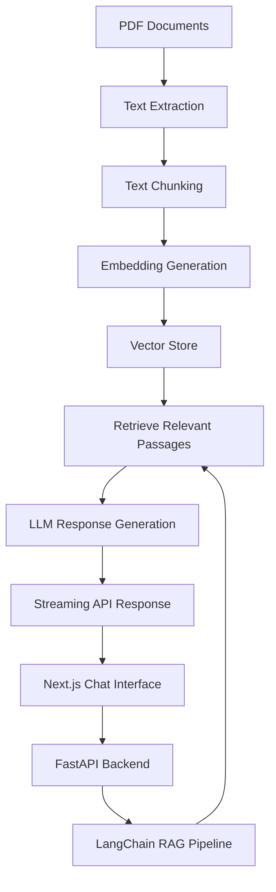

# RAG Chatbot

A document-grounded AI assistant built for the **RAG Chatbot Hackathon**.

This project uses Retrieval-Augmented Generation (RAG) to let users ask questions about PDF documents and receive answers based on their content. It combines a modern conversational interface with a Python backend that handles document processing, retrieval, and LLM-powered response generation.

The goal is to make document-based research more intuitive by turning static files into an interactive knowledge source.

## Overview

Finding specific information in lengthy documents can be time-consuming. This chatbot aims to simplify that process by allowing users to interact with their documents through natural language rather than manually searching page by page.

The application follows a client-server architecture, with a Next.js frontend responsible for the user experience and a Python backend responsible for the RAG pipeline and AI processing.

## Core Features

* **PDF Question Answering:** Ask questions about uploaded documents and retrieve relevant information.
* **Context-Aware Responses:** Generate answers using retrieved document passages as context.
* **Streaming Responses:** Display generated answers progressively rather than waiting for the entire response.
* **Conversation History:** Navigate previous conversations through a dedicated sidebar.
* **Interactive Chat Interface:** A clean, responsive interface designed for a smooth conversational experience.
* **Semantic Retrieval:** Search document content by meaning rather than relying exclusively on exact keyword matches.
* **Modular Architecture:** Keep the frontend, API layer, and RAG pipeline separated for easier development and maintenance.

Features are subject to the final implementation and integration.

## System Architecture

The application is divided into two primary layers.

**Frontend**

* Next.js
* React
* TypeScript
* Responsive chat interface
* Conversation history sidebar
* Streaming response display

**Backend**

* Python
* FastAPI
* LangChain
* PDF text extraction and processing
* Text chunking and embedding generation
* Vector-based retrieval
* LLM-powered answer generation

The embedding model, vector store, and language model will be documented once the final choices are confirmed.

## How It Works

The RAG pipeline connects document ingestion with retrieval and response generation.

1. **Document ingestion:** Extract text from PDF files.
2. **Chunking:** Divide the extracted text into manageable passages while preserving useful context.
3. **Embedding generation:** Convert passages into vector representations for semantic search.
4. **Indexing:** Store the embeddings in a vector store for efficient retrieval.
5. **Query processing:** Receive a user's question through the FastAPI backend.
6. **Retrieval:** Find document passages relevant to the question.
7. **Generation:** Pass the question and retrieved context to the language model.
8. **Streaming:** Return the generated answer progressively to the frontend.

## Technology Stack

| Layer          | Technologies                  |
| -------------- | ----------------------------- |
| Frontend       | Next.js, React, TypeScript    |
| Backend        | Python, FastAPI               |
| RAG Framework  | LangChain                     |
| Document Input | PDF                           |
| Embeddings     | To be confirmed               |
| Vector Store   | To be confirmed               |
| Language Model | To be confirmed               |
| Communication  | HTTP API, streaming responses |

## Team

Built by a collaborative team for the SENTEC RAG Chatbot Hackathon.

| Team Member     | GitHub                                                                   |
| --------------- | ------------------------------------------------------------------------ |
| Hafeez Siddiqui |[@hafeezsiddiqui27](https://github.com/hafeezsiddiqui27)                  |
| Muhammad Hunain |[@Muhammad-Hunain-Official](https://github.com/Muhammad-Hunain-Official)  |
| Hashim Raza     |[@hashimraza-1307](https://github.com/hashimraza-1307)                    |

## Development Goals

The project focuses on building a complete, working RAG application rather than a basic chatbot wrapper.

Key priorities include:

* Relevant and reliable document retrieval.
* Answers grounded in retrieved document content.
* Responsive streaming and a smooth chat experience.
* Clear separation between frontend and backend responsibilities.
* Maintainable code and reliable API integration.
* A foundation for evaluating retrieval quality and answer accuracy.

## Future Improvements

Potential improvements include:

* Citations linked to source documents and page numbers.
* Support for multiple PDFs and larger document collections.
* Better retrieval through metadata filtering and reranking.
* Conversation persistence across sessions.
* Evaluation of retrieval relevance and answer faithfulness.
* Improved handling of scanned PDFs and documents with complex layouts.

## Project Status

Developed as part of the RAG Chatbot Hackathon. The final capabilities, model configuration, and deployment details will be updated as implementation progresses.

**SENTEC RAG Chatbot**
*Making document knowledge easier to access through conversational AI.*
